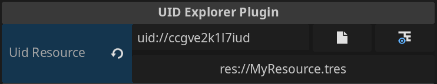
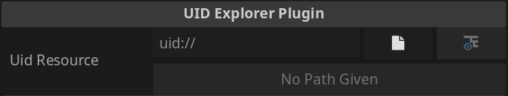
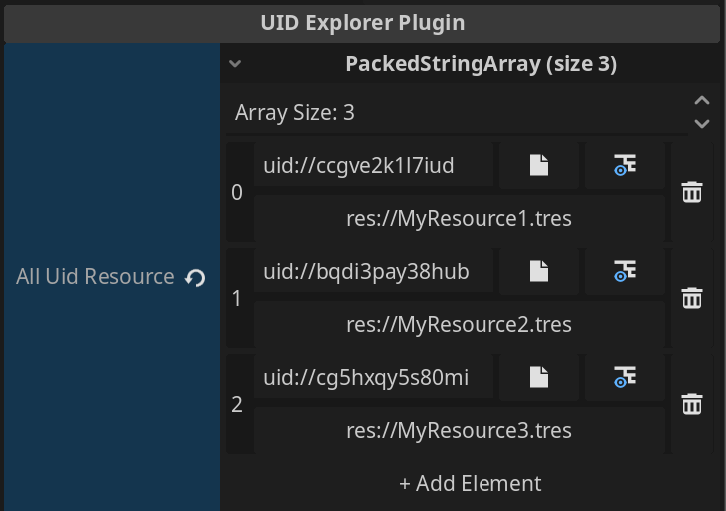

<div align="center">

<h1>UID Explorer Plugin</h1>
</div>

An inspector plugin for the [Godot](https://godotengine.org/) game engine.

<p align="center">
    
</p>

<p align="center">
    
</p>

## Overview
Adds a new property hint for `string` [export properties](https://docs.godotengine.org/en/stable/tutorials/scripting/c_sharp/c_sharp_exports.html#doc-c-sharp-exports). This property hint provides better navigation and viewing capabilities for resources and file selection. Adds the ability to select a file in the editor, navigate to it in the file system, and populate the property with the resource's [UID](https://docs.godotengine.org/en/stable/classes/class_resourceuid.html). The resource can also be expanded by pressing the button with the converted path.

## How to Use
1. Create a `string` variable. (Can be in `C#`, `GDScript` or any language exposed to the Godot API.)
2. Expose the variable to the editor. (Using the export annotation.)
3. Set the property hint as a `File`.
4. Specify filter as `uid`.

Example: `C#`
```csharp
[Export(PropertyHint.File, "uid")]
private string myResourcePath = "";

Resource myResource = ResourceLoader.Load(myResourcePath);

[Export(PropertyHint.File, "uid")]
private string[] multipleResourcePaths = Array.Empty<string>();
```
Example: `GDScript`
```javascript
@export_file("uid")
var my_resource_path: String = ""

var my_resource: Resource = load(my_resource_path)
```

## Installation
**(Must have C# enabled editor. Tested on `v4.3.stable.mono, v4.4.1.stable.mono, v4.5.1.stable.mono`)**
1. Place base directory in the `addons` folder of your project.
2. Make sure to press the build button to compile `C#` assemblies.
3. Enable in the plugins tab.

## Changelog
* 1.3: Added support for Arrays. `string[]` are serialized as `PackedStringArray`. Pagination supported. Can configure number of elements per page in settings. Refactored plugin to decrease unused spacing and replaced text with new icons.
* 1.2: Added support for drag and drop functionality. Just drag the resource you want on the inspector and the UID will populate the correct field.
* 1.1: Added better file filtering for other resource types. Added a cache for previously selected files for better navigation.

<p align="center">
    
</p>

## What is this useful for?
Recent Godot versions have improved UID support. Referencing files with an ID can be beneficial over using a traditional file path because when paths change, the original reference becomes outdated, and then things break. But for UIDs, they should stay the same regardless of the file location. 

Great! So what's the problem?

A downside of UIDs is that one can't tell the location of the file by just looking at it since it's not a path or which file it's supposed to be referring to. For example, when you see a file path that says `res://my_data/MyResource.tres` you can figure out where it is and what the resource is. However, with UIDs, ex- `uid://ccgve2k1l7iud` you can't tell either. You'd have to cross reference the UID in some code editor to see which resource the UID belongs to.

Until *now*! With this plugin, UIDs populated in the inspector will convert the file UID to its corresponding file path. It's based off the UID so it's just a utility to provide a way to show what the UID represents. On top of that, the plugin adds additional utility that is just generally useful to have in the inspector because the button below will expand the resource or navigate to the file system location.

Lastly, exporting the file path as opposed to just the resource itself may be preferable because there's a greater degree of control how the resource is loaded which can be useful in many scenarios.