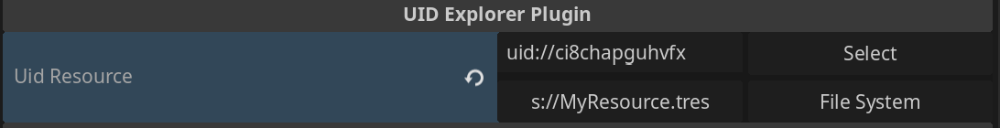

# UID Explorer Plugin

An inspector plugin for the [Godot](https://godotengine.org/) game engine.

<p align="center">
    
</p>

## Overview
Adds a new [property hint](https://docs.godotengine.org/en/stable/tutorials/scripting/c_sharp/c_sharp_exports.html#doc-c-sharp-exports) for the `[Export]` annotation. This annotation adds the ability to select a file in the editor and populate the `[Export]` property with the resource's [UID](https://docs.godotengine.org/en/stable/classes/class_resourceuid.html). Below the populated `uid://` is a button that selects the corresponding resource in the Godot file system. 

## How to Use
1. Variable must be a `string`.
2. Use `[Export]` annotation above variable.
3. Property hint must be `File`.
4. Specify filter as `uid`.

Ex:
```
[Export(PropertyHint.File, "uid")]
private string myResourcePath = "";

Resource myResource = ResourceLoader.Load(myResourcePath);
```

## Installation
**(Tested on Godot `v4.3.stable.mono`)**
1. Place base directory in the `addons` folder of your project.
2. Make sure to press the build button to compile C# assemblies.
3. Enable in the plugins tab.

## What is this useful for?
Previous Godot versions have lacked a stable, battle-tested workflow regarding file system references. That's because references between resources would contain the file system path.

Why is that a problem?

Paths change! So when that occurred, things would often break. So, in comes `UID`. `UID`s are a solution to referencing resources in one's project in a path agnostic way. So that means one can change the location of their file and stuff should break less often.

So `UID`s are just better?

Not in every way. Unlike file paths, `UID`s aren't human readable in the same way. For example, when you see a file path that says `res://my_data/MyResource.tres` you can figure out the location and what the resource is by just looking at it. You can't tell either with `UID`s because they look like this: `uid://1234567`. Where is that file located? What resource is it referring to? Without cross referencing the `UID` in some code editor there's no easy way to know.

Until *now*! With this plugin, `UID`s populated in the inspector will convert the file `UID` to its corresponding file path. It's based off the `UID` so it's just a utility to make `UID`s a bit more human readable. On top of that, the button below will navigate the file system to the exact location of the resource the `UID` references, which is quite helpful when referencing file paths in general.

Although Godot's documentation isn't explicit about this, `UID`s are often interchangeable with traditional file paths (`res://`). That means when using methods like `GD.Load()` or `ResourceLoader.Load()` either `res://` or `uid://` based paths work the same.

More support could be added in Godot with `UID`s in general. For example, one cannot search for a file by its `UID` in the Godot `FileSystem` search bar! Such functionality I've added as a [proposal](https://github.com/godotengine/godot-proposals/issues/10737), so give that a thumbs up.